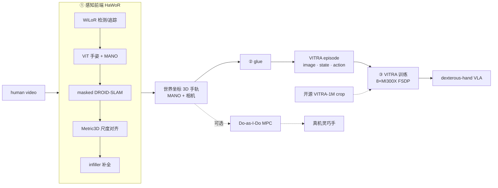

# human-to-humanoid

在 AMD Instinct（MI300X / ROCm）上打通 **human video → 显式 3D 手部运动 → dexterous-hand VLA** 的端到端管线

---

## Overview Arch

管线：**human video → 显式 3D 手部运动 → 可训练三元组 → dexterous-hand VLA**（可选分支落真机）。下图各阶段均已在 AMD Instinct MI300X / gfx942 上验证。

## PoC：human video → explicit 3D → VLA

### 目标
证明"人类视频当 VLA 预训练数据"这条范式（VITRA 式）可在单节点 MI300X 上端到端复现：视频经 HaWoR 前端恢复出逐帧 3D 手部运动（MANO），对齐成 `(image, instruction, action)` 三元组，训练/微调 dexterous-hand VLA。

### 管线与 ROCm 现状
| 阶段 | 组件 | ROCm 状态 |
|---|---|---|
| 感知前端（video→3D 手轨） | HaWoR = WiLoR 检测 + ViT 手姿 + masked DROID-SLAM + Metric3D + infiller | 已验证（含 lietorch / masked DROID-SLAM 自定义 kernel，MI300X） |
| 点轨迹 / 分割 / 深度 | TAPIR、GroundingDINO/SAM2/SAM3、Depth-Anything-3 | 已验证 |
| VLA 本体 | VITRA = PaliGemma2-3B + DiT 动作头 | ✅ 推理 + **8×MI300X FSDP 训练闭环**均已验证（见 `docs/WIP.md §1`） |
| 重定向（可选，落真机） | Do-as-I-Do = MuJoCo-Warp MPC | 已验证 |

### 参考实现（均已开源，2025-11 起）
- **VITRA**（microsoft/VITRA，ICRA 2026，arXiv:2510.21571）：开源**从零预训练 + 机器人微调**代码、3B 预训练权重（`VITRA-VLA/VITRA-VLA-3B`）、**VITRA-1M** 标注数据集（1.2M episodes，MANO 3D 手 + 相机参数，仅 metadata、原视频需自取）、遥操作微调数据（`VITRA-TeleData`）。数据管线自带 HaWoR/WiLoR 手部重建。基座从 `google/paligemma2-3b-mix-224` 微调（需申请权限）。训练标称 CUDA≥12.1 / A100-H100，纯 PyTorch，可移植 ROCm。

- **DexWM**（facebookresearch/dexwm，arXiv:2512.13644，FAIR）：`video → 3D → world model` 的参考实现。动作 = 3D 手部关键点差分 + 相机运动；latent world model 预测未来 latent 状态 + hand consistency loss；EgoDex+DROID 预训练、RoboCasa 微调（数据 1.74TB 在 HF）。训练依赖单独的 keypoint model 与 decoder，管线更重。

### 里程碑（按 `docs/study.md §1` 的 L1 → L2 → L3 路线）

完整路线 = **L1 pretrain → L2 post-train → L3 sim deployment**（+ L4 真机，无真机排除）。当前已完成工作全在 L1。

| 阶段 | 内容 | 状态 |
|---|---|---|
| **L1 pretrain**（数据 + 模型先验） | HaWoR 前端 + VITRA VLA 本体在 8×MI300X ROCm 端到端跑通（推理 + 多卡 FSDP 训练闭环，**零 VITRA fork**）。详见 `docs/WIP.md §1/§2` | ✅ 已完成（2026-07） |
| **L2 post-train**（embodiment alignment） | VITRA 手部输出 → dex-retarget 到 **sim floating 灵巧手** 量 baseline；不够再整模型续训（保留动作先验）。详见 `docs/study.md §1` | ⬜ **下一步** |
| **L3 sim deployment**（补物理 + 验证） | MuJoCo-Warp / Genesis 补 contact/force，量抓取成功率、RL 修正闭环 | ⬜ 未做 |
| （L4 真机部署） | 真实相机 / 控制器 / 延迟 | ✗ 无真机，短期不做 |

**分叉（非主线）**
- **M1' 自采数据（L1 扩展，条件触发）**：训练闭环已验证、自采代价高——仅当有差异化 thesis（覆盖 VITRA-1M 没有的场景/任务/embodiment）才用 HaWoR e2e 自采数十–200hrs；否则 HaWoR e2e 只作「ROCm 已验证」的能力性结论。用 HaWoR 重跑开源 ego 数据 = 重造 VITRA-1M，不做。
- **M3 WM（L1 增量，后续）**：L1 产出的每帧 3D 状态既是 VLA action label，也能当物理基础 WM 的状态序列（blog `human-for-humanoid/readme.md §6`），复用训练 infra 作可选分叉。**不做**从零预训练纯像素视频 WM（多节点、数周、物理一致性未解）。
- **全量 VLA 训练**：属算法层、非 AMD 战场（`docs/strategy.md §2.1/§2.2`），训练闭环已 de-risk 即够，不放量。

### 约束
- VITRA-1M 仅发 annotation，raw video 因版权需自行 re-fetch。
- PaliGemma2 基座需申请权限（已确认 token 可拉）。
