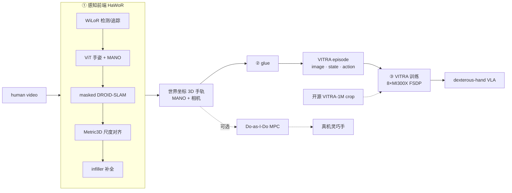

# human-to-humanoid

在 AMD Instinct（MI300X / ROCm）上打通 **human video → 显式 3D 手部运动 → dexterous-hand VLA** 的端到端管线，进而自产 humanoid-ready 数据、训练/微调小 base VLA。

---

## Overview Arch

管线：**human video → 显式 3D 手部运动 → 可训练三元组 → dexterous-hand VLA**（可选分支落真机）。下图各阶段均已在 AMD Instinct MI300X / gfx942 上验证。

> 各阶段均已在 MI300X / gfx942 验证。实线 = 自产数据主链；虚线 = 开源 crop 直训路径（M1 走的）与可选真机重定向分支。复现命令见 `scripts/README.md`。

## PoC：human video → explicit 3D → VLA

### 目标
证明"人类视频当 VLA 预训练数据"这条范式（VITRA 式）可在单节点 MI300X 上端到端复现：视频经 HaWoR 前端恢复出逐帧 3D 手部运动（MANO），对齐成 `(image, instruction, action)` 三元组，训练/微调 dexterous-hand VLA。

### 管线与 ROCm 现状
| 阶段 | 组件 | ROCm 状态 |
|---|---|---|
| 感知前端（video→3D 手轨） | HaWoR = WiLoR 检测 + ViT 手姿 + masked DROID-SLAM + Metric3D + infiller | 已验证（含 lietorch / masked DROID-SLAM 自定义 kernel，MI300X） |
| 点轨迹 / 分割 / 深度 | TAPIR、GroundingDINO/SAM2/SAM3、Depth-Anything-3 | 已验证 |
| VLA 本体 | VITRA = PaliGemma2-3B + DiT 动作头 | ✅ 推理 + **8×MI300X FSDP 训练闭环**均已验证（见 `docs/WIP.md §1`） |
| 重定向（可选，落真机） | Do-as-I-Do = MuJoCo-Warp MPC | 已验证 |

各阶段均已在 MI300X 逐段验证：前端自定义 kernel（masked DROID-SLAM / lietorch）已 hipify，VLA 训练闭环 2026-07 跑通（多卡 FSDP + RCCL，见 `docs/WIP.md`）。剩余工作是**把感知前端当数据工厂跑起来、量出 $/video-hour**（`docs/WIP.md §3`），不是移植可行性，也不是放量训 VLA（算法层、非 AMD 战场，见 `why.md §0/§2`）。

### 参考实现（均已开源，2025-11 起）
- **VITRA**（microsoft/VITRA，ICRA 2026，arXiv:2510.21571）：开源**从零预训练 + 机器人微调**代码、3B 预训练权重（`VITRA-VLA/VITRA-VLA-3B`）、**VITRA-1M** 标注数据集（1.2M episodes，MANO 3D 手 + 相机参数，仅 metadata、原视频需自取）、遥操作微调数据（`VITRA-TeleData`）。数据管线自带 HaWoR/WiLoR 手部重建。基座从 `google/paligemma2-3b-mix-224` 微调（需申请权限）。训练标称 CUDA≥12.1 / A100-H100，纯 PyTorch，可移植 ROCm。
- **DexWM**（facebookresearch/dexwm，arXiv:2512.13644，FAIR）：`video → 3D → world model` 的参考实现。动作 = 3D 手部关键点差分 + 相机运动；latent world model 预测未来 latent 状态 + hand consistency loss；EgoDex+DROID 预训练、RoboCasa 微调（数据 1.74TB 在 HF）。训练依赖单独的 keypoint model 与 decoder，管线更重。

### 里程碑
M1 主线是把 VITRA 训练闭环搬到 ROCm，已完成（2026-07，见下表 / `docs/WIP.md`）。走这条路的依据：数据不是瓶颈——VITRA-1M annotation 全开源，本就是 HaWoR/WiLoR 跑 Ego4D/EPIC/EgoExo4D/SSv2 得到的；所以用开源数据 crop 一小片打通训练是成本最低、信息量最高的一步，自采数据留到有差异化需求时再做。

| 里程碑 | 内容 | 复用 |
|---|---|---|
| **M1 训练闭环（P0）✅ 已完成（2026-07）** | 从 VITRA-1M crop 10k SSv2 episodes（9403 videos / 213835 frames），在 8×MI300X 跑通 VITRA 训练闭环。**结果**：FSDP(shard-grad-op) + RCCL + bf16 + 真 dataloader 跑满 1000 步，loss 0.29→0.21、4 个 ckpt、resume（含 optimizer state）正常；确认 **deepspeed/flash-attn 均非必需**（DiT 用 torch SDPA）。适配仅 1 env（`HSA_NO_SCRATCH_RECLAIM=1`）+ 1 依赖钉版（`utils3d`）+ 1 平台无关 decord 修复，**零 VITRA fork**。见 `docs/WIP.md §1` / `overnight_tasks/VITRA/experiments.md` | VITRA 开源训练代码 + 现成 annotation |
| **感知数据工厂 workload（P0，进行中）** | 真正的 impact workload（`why.md` §4–5）：把感知前端当**数据工厂**跑起来并量出 **$/video-hour**。拆 P1 三元组导出（glue）→ P2 经济 benchmark → P3 瓶颈 kernel（护城河），补齐 `why.md` §6.1 三源栈的 real-video 块。见 `docs/WIP.md §3` | §1 VITRA + §2 HaWoR ROCm 栈 |
| **M2 全量 VLA 训练（P3）** | 放量训 VLA 属算法层、非 AMD 战场（`why.md §0/§2`），训练闭环已 de-risk 即够，不放量 | — |
| **M1' 自采数据（条件触发）** | 训练闭环已验证（M1），故现在只差 (b) 差异化 thesis（自采能覆盖 VITRA-1M 覆盖不到的场景/任务/目标 embodiment）——满足才用 HaWoR e2e 自采数十–200hrs 新数据。否则 HaWoR e2e 只作为「ROCm 已验证」的能力性结论，不作为要产出的大数据集里程碑 | HaWoR ROCm 栈 |
| **M3 WM（增量，后续）** | 复用 3D 状态序列，将训练目标改为动作条件下预测未来 3D 状态，参考 DexWM 建结构化/物理基础 WM | M1 训练 infra + 3D 状态数据 |

### 路线决策：数据后置，WM 作增量分叉
> M1 训练闭环已验证（2026-07），重心已转向**感知数据工厂 workload**（`docs/WIP.md §3`），全量 VLA 训练降级（见上表）。以下为仍然生效的排序原则：
- **数据后置（M1'）**：训练闭环已验证，自采数据代价高，仅当有差异化需求时才划算；用 HaWoR 重跑开源 ego-centric 数据只是重造 VITRA-1M，不做。
- **WM（DexWM 式）作后续增量**：训练产出的"每帧 3D 状态"既是 VLA 的 action label，也能当物理基础 WM 的状态序列（见 `docs/study.md §8`）——复用已跑通的训练 infra，作为 M1 之后的可选分叉，非当前重点。
- **不做**：从零预训练大规模纯像素视频世界模型（多节点、数周、物理一致性未解）。

### 约束
- VITRA-1M 仅发 annotation，raw video 因版权需自行 re-fetch。
- PaliGemma2 基座需申请权限（已确认 token 可拉）。
